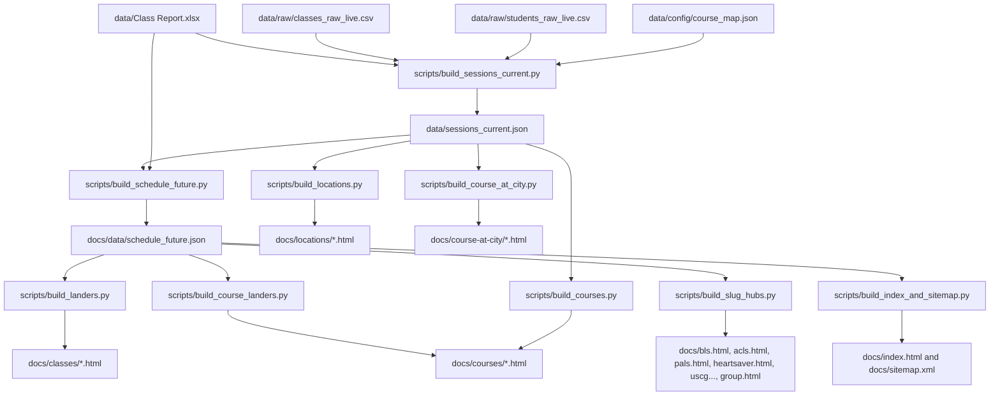
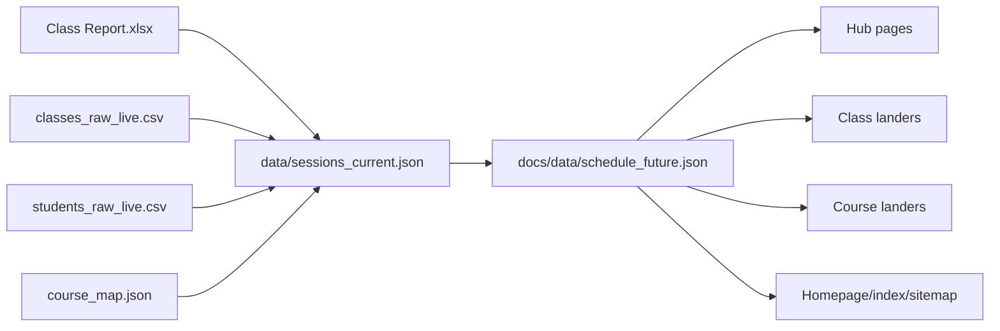
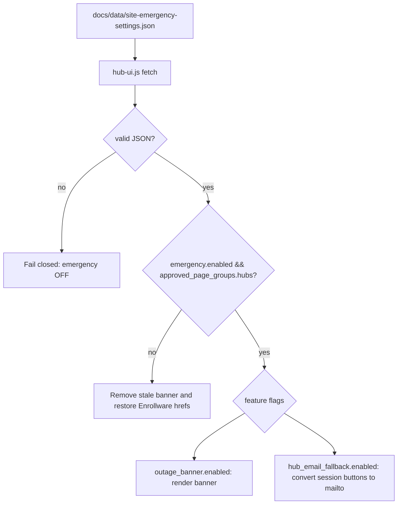

# 910CPR Stack Architecture

This document describes the current static build architecture in `E:\GitHub\910cpr-class-landers`.

The public site is generated into `docs/` and deployed by GitHub Pages. Runtime browser JavaScript can fetch JSON files and external Enrollware endpoints, but there is no public backend in this repository.

## High-Level Data Flow



## Data Sources

Primary sources:

- `data/Class Report.xlsx`: authoritative session list.
- `data/raw/classes_raw_live.csv`: live class export used to patch/enrich sessions.
- `data/raw/students_raw_live.csv`: live student/export data used for enrollment counts.
- `data/config/course_map.json`: structured course metadata keyed by stable Enrollware identifiers.
- `data/config/slug_hubs.json`: hub page manifest and tab definitions.
- `data/raw/reviews/reviews.json`: reviews content used by homepage/hubs.

Legacy/alternate sources:

- `data/course-export.xlsx`
- `data/enrollware_export.xlsx`
- `data/schedule.json`
- `docs/public_schedule.json`
- `docs/data/public_schedule.json`

## Intermediate Files

Important intermediate/generated files:

- `data/sessions_current.json`: merged canonical current session set.
- `docs/data/schedule_future.json`: public future schedule feed.
- `data/runtime/*.json`: build phase status and debug receipts.
- `debug/status/*.json`: Control Booth status receipts.
- `data/audit/*.json`: mapping and data-quality reports.
- `data/audit/*.md`: human-readable audit reports.

## Public JSON Outputs

Public JSON served by GitHub Pages:

- `docs/data/schedule_future.json`
- `docs/data/site-emergency-settings.json`
- `docs/public_schedule.json` if present
- `docs/data/public_schedule.json` if present

`docs/data/schedule_future.json` is the main modern public schedule feed.

## Runtime Browser-Loaded JSON Systems

Runtime JSON consumers:

- `docs/assets/booking-home.js`
  - fetches `/data/schedule_future.json` and optional public schedule JSON paths.
- `docs/assets/hub-ui.js`
  - fetches `/data/site-emergency-settings.json`.
- `debug/control-booth.html`
  - fetches `control_booth_data.json`.

Runtime JSON is static-file JSON. GitHub Pages serves it as files; nothing recomputes server-side.

## Hub Generation Pipeline

Inputs:

- `data/config/slug_hubs.json`
- `docs/data/schedule_future.json`
- `data/sessions_current.json`
- `data/raw/reviews/reviews.json`

Builder:

```text
scripts/build_slug_hubs.py
```

Outputs:

- `docs/bls.html`
- `docs/acls.html`
- `docs/pals.html`
- `docs/heartsaver.html`
- `docs/uscg-elementary-first-aid-cpr.html`
- `docs/group.html`
- `data/runtime/acls_hub_debug.json`
- `data/runtime/heartsaver_hub_debug.json`
- `data/runtime/build_slug_hubs.json`
- `debug/status/build_slug_hubs.json`

The hub builder renders normal Enrollware registration links by default. Emergency email behavior is not baked into generated hub HTML; it is controlled at runtime by `docs/assets/hub-ui.js` and `docs/data/site-emergency-settings.json`.

## Session Inventory Flow



`data/sessions_current.json` is richer and internal. `docs/data/schedule_future.json` is filtered for future public availability and excludes orphan/unmapped sessions.

## Enrollware, HOVN, Schedule JSON, And Landers

### Enrollware

Enrollware is the registration and payment surface. The generated site links users to Enrollware URLs such as:

```text
https://coastalcprtraining.enrollware.com/enroll?id=...
```

Relevant code:

- `scripts/build_sessions_current.py` extracts session IDs from Enrollware registration links.
- `scripts/hybrid_inventory.py` defines Enrollware appointment URLs/endpoints.
- `docs/assets/hybrid-inventory.js` can call Enrollware appointment availability from the browser.
- `scripts/enrollware_sync.py` supports dry-run/reconcile/scaffold workflows for comparing desired sessions against Enrollware exports.

### HOVN

No implemented HOVN integration was found in source files, config files, public assets, or generated docs. The only `HOVN` matches were in `thread.txt`, which is conversation history, not application code. Therefore HOVN is not part of the current executable build stack documented here.

### `data/sessions_current.json`

Internal merged session file produced by `scripts/build_sessions_current.py`.

Uses:

- source for `docs/data/schedule_future.json`
- source for filtered course/location/course-at-city builders
- debug/reconciliation source for hub builder
- count source for Control Booth

### `docs/data/schedule_future.json`

Public future schedule feed produced by `scripts/build_schedule_future.py`.

Uses:

- hub page generation
- class lander generation
- exact course landers
- index/sitemap generation
- home runtime schedule loading

### Generated Landers

Generated landers are static HTML under:

- `docs/classes/`
- `docs/courses/`
- `docs/locations/`
- `docs/course-at-city/`
- root hub pages in `docs/`

They are regenerated from JSON and config; do not treat them as source of truth.

## Runtime JS Systems

### `docs/assets/hub-ui.js`

Runs on hub pages and request-related generated pages. Current responsibilities:

- tab behavior
- session grouping by day
- expired-session pruning
- empty states
- emergency settings JSON fetch
- outage banner display/removal
- hub email fallback and restoration from `data-original-href`
- stale baked emergency HTML cleanup when settings are OFF

### `docs/assets/hybrid-inventory.js`

Runs flexible inventory panels generated by `scripts/build_slug_hubs.py` and some course landers.

Responsibilities:

- reads `data-flexible-availability` payloads from HTML
- caches results in `sessionStorage`
- POSTs to Enrollware appointment endpoint
- renders returned appointment rows
- falls back to the Enrollware open-seat page when live availability fails

Known limitation: browser cross-origin policy can block Enrollware appointment POSTs, so this system must fail gracefully.

### `docs/assets/live-sessions.js`

Prunes expired session items and adds empty state messaging for live session groups.

### `docs/assets/session-expiry.js`

Generic runtime session expiry/sort helper for elements with `data-start` or `data-session-start`.

### `docs/assets/booking-home.js`

Homepage schedule runtime system. It loads optional schedule JSON feeds including `/data/schedule_future.json`.

## Static Vs Runtime-Generated

Static at deploy time:

- all HTML files under `docs/`
- all CSS/images/assets under `docs/`
- `docs/data/*.json`
- `docs/sitemap.xml`

Runtime in browser:

- tab switching
- expired-session hiding
- JSON fetches
- emergency mode application/restoration
- flexible Enrollware appointment lookup
- Control Booth data display

No public page can write JSON or rebuild HTML by itself.

## Emergency Mode Architecture

Settings file:

```text
docs/data/site-emergency-settings.json
```

Runtime consumer:

```text
docs/assets/hub-ui.js
```

Core rules:

- Defaults are OFF.
- Missing/invalid/unavailable JSON fails closed.
- Emergency behavior requires `emergency.enabled=true`.
- Each feature also requires its own flag:
  - `emergency.outage_banner.enabled`
  - `emergency.hub_email_fallback.enabled`
- Approved page groups are explicit.
- Hub email fallback applies only to session inventory buttons with session IDs.
- Group training request buttons should remain normal request links.
- `data-original-href` stores Enrollware registration URLs so runtime can restore them.



## Control Booth Architecture

Generator:

```text
scripts/build_control_booth.py
```

Data output:

```text
debug/control_booth_data.json
```

Viewer:

```text
debug/control-booth.html
```

Sources read by generator:

- `debug/status/*.json`
- `data/runtime/*.json`
- `data/sessions_current.json`
- `docs/data/schedule_future.json`
- `data/audit/*.json`
- `data/analytics/ga4_latest.csv` if present
- `docs/data/site-emergency-settings.json`

The Control Booth is read-only. It does not toggle emergency settings and does not write public JSON from the browser.

## GitHub Pages Limitations

GitHub Pages serves static files only.

Implications:

- No server-side rebuilds.
- No server-side writes from Control Booth.
- JSON changes require commit/push.
- HTML changes require local rebuild, commit, and push.
- Runtime JavaScript can only fetch files/endpoints allowed by browser and CORS policy.
- Enrollware appointment POSTs may fail if CORS blocks the request.

## Cache Behavior Considerations

Caching layers:

- browser cache
- GitHub Pages/CDN cache
- `sessionStorage` used by `docs/assets/hybrid-inventory.js`

Emergency settings fetch uses `cache: "no-store"` in `hub-ui.js`, but deployed asset/HTML cache can still affect what a visitor sees immediately after push.

If live behavior does not match the repo:

1. Confirm GitHub Pages deploy finished.
2. Confirm `docs/data/site-emergency-settings.json` in production.
3. Hard refresh browser.
4. Check whether `docs/assets/hub-ui.js` in production is the current committed version.
5. Search generated hub HTML for baked emergency strings.

## Build Status Architecture

`scripts/build_status.py` provides `BuildStatusReporter`.

Writers:

- modern builders such as `build_sessions_current`, `build_schedule_future`, `build_slug_hubs`, `build_courses`, `build_locations`, `build_course_at_city`, `build_request_group_session`, `build_index_and_sitemap`, and `build_all_v4.py`

Outputs:

- `data/runtime/<phase>.json`
- `debug/status/<phase>.json`

`scripts/build_control_booth.py` reads these status files and also flags missing status files for expected phases.

## Legacy And Compatibility Paths

The repo contains older schedule/public schedule builders and files:

- `build/build_all_v3.bat`
- `scripts/build_schedule_json.py`
- `scripts/build_index.py`
- `scripts/build_discovery.py`
- `scripts/build_public_schedule_json.py`
- `scripts/build_public_schedule_compat.py`
- `data/schedule.json`
- `docs/public_schedule.json`
- `docs/data/public_schedule.json`

These may still support archive or compatibility pages, but the modern hub stack centers on:

- `data/sessions_current.json`
- `docs/data/schedule_future.json`
- `scripts/build_slug_hubs.py`
- `docs/assets/hub-ui.js`

